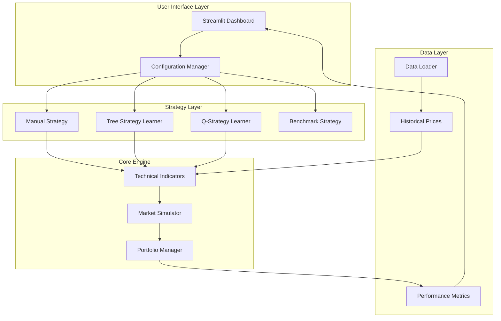

# TradingStrategist 📈

<div align="center">

[](https://www.python.org/downloads/)
[](https://streamlit.io/)
[](LICENSE)
[](https://scikit-learn.org/)
[](https://pandas.pydata.org/)
[](https://numpy.org/)

```
████████╗██████╗  █████╗ ██████╗ ██╗███╗   ██╗ ██████╗     ███████╗████████╗██████╗  █████╗ ████████╗███████╗ ██████╗ ██╗███████╗████████╗
╚══██╔══╝██╔══██╗██╔══██╗██╔══██╗██║████╗  ██║██╔════╝     ██╔════╝╚══██╔══╝██╔══██╗██╔══██╗╚══██╔══╝██╔════╝██╔════╝ ██║██╔════╝╚══██╔══╝
   ██║   ██████╔╝███████║██║  ██║██║██╔██╗ ██║██║  ███╗    ███████╗   ██║   ██████╔╝███████║   ██║   █████╗  ██║  ███╗██║███████╗   ██║   
   ██║   ██╔══██╗██╔══██║██║  ██║██║██║╚██╗██║██║   ██║    ╚════██║   ██║   ██╔══██╗██╔══██║   ██║   ██╔══╝  ██║   ██║██║╚════██║   ██║   
   ██║   ██║  ██║██║  ██║██████╔╝██║██║ ╚████║╚██████╔╝    ███████║   ██║   ██║  ██║██║  ██║   ██║   ███████╗╚██████╔╝██║███████║   ██║   
   ╚═╝   ╚═╝  ╚═╝╚═╝  ╚═╝╚═════╝ ╚═╝╚═╝  ╚═══╝ ╚═════╝     ╚══════╝   ╚═╝   ╚═╝  ╚═╝╚═╝  ╚═╝   ╚═╝   ╚══════╝ ╚═════╝ ╚═╝╚══════╝   ╚═╝   
```

**An enterprise-grade machine learning framework for quantitative trading strategy development, backtesting, and portfolio optimization**

[🚀 Live Demo](YOUR_STREAMLIT_DEPLOYMENT_URL) • [📖 Documentation](#-documentation) • [💻 Installation](#-installation) • [🔧 Configuration](#-configuration)

</div>

---

## 🎯 Overview

TradingStrategist is a comprehensive, production-ready machine learning platform that enables traders, researchers, and quantitative analysts to develop, test, and deploy sophisticated algorithmic trading strategies. Built with a modular architecture and powered by modern ML techniques, it provides everything needed for end-to-end quantitative strategy development.

### 🌟 Key Features

| Feature | Description |
|---------|-------------|
| **🤖 Multi-Strategy Framework** | Rule-based, Machine Learning (Random Forest), and Reinforcement Learning (Q-Learning) approaches |
| **📊 Advanced Technical Analysis** | 10+ built-in indicators with configurable parameters and custom indicator support |
| **💼 Portfolio Management** | Multi-asset portfolio optimization with custom weighting and correlation analysis |
| **🎯 Realistic Backtesting** | Multiple transaction cost models, market impact simulation, and slippage modeling |
| **📈 Performance Analytics** | Comprehensive metrics including Sharpe ratio, drawdown analysis, and risk-adjusted returns |
| **🖥️ Interactive Web Interface** | Modern Streamlit-powered dashboard for strategy development and analysis |
| **⚙️ Configuration-Driven** | YAML-based configuration system for reproducible research and parameter management |
| **🔧 Extensible Architecture** | Plugin-based design for custom strategies, indicators, and cost models |

---

## 🚀 Quick Start

### Prerequisites

- **Python 3.11+** (Recommended: 3.11.0)
- **Conda** or **pip** package manager
- **Git** for version control
- **8GB+ RAM** (for large dataset processing)

### 🐍 Installation

#### Option 1: Conda Environment (Recommended)

```bash
# Clone the repository
git clone https://github.com/your-username/ML-Trading-Strategist.git
cd ML-Trading-Strategist

# Create and activate conda environment
conda env create -f environment.yaml
conda activate trading-strategist

# Verify installation
python -c "import streamlit; print('✅ Installation successful!')"
```

#### Option 2: Pip Installation

```bash
# Clone and navigate
git clone https://github.com/your-username/ML-Trading-Strategist.git
cd ML-Trading-Strategist

# Install dependencies
pip install -r requirements.txt

# Verify installation
python -c "import streamlit; print('✅ Installation successful!')"
```

### 📊 Data Setup

TradingStrategist requires historical stock price data. Choose your preferred method:

#### 🎯 Option 1: Pre-downloaded Dataset (Fastest)

```bash
# Download complete S&P 500 dataset (2000-2025)
git clone https://github.com/Adredes-weslee/ML-Trading-Strategist-Data.git data

# Verify data integrity
python -m src.TradingStrategist.data.check_data
```

#### 🔄 Option 2: Fresh Data Download

```bash
# Download latest data from Yahoo Finance
python -m src.TradingStrategist.data.download_sp500_data

# Note: May take 2-4 hours due to rate limiting
```

### 🖥️ Launch Application

```bash
# Start the Streamlit dashboard
streamlit run app.py

# Open browser to: http://localhost:8501
```

---

## 🧠 Trading Strategies

TradingStrategist implements four distinct algorithmic approaches, each designed for different market conditions and risk profiles:

### 📊 Benchmark Strategy
- **Type**: Passive Investment
- **Approach**: Buy-and-hold baseline for performance comparison
- **Use Case**: Market index tracking and strategy benchmarking
- **Features**: Single stock or portfolio allocation with custom weighting

### 🔧 Manual Strategy
- **Type**: Rule-Based Technical Analysis
- **Approach**: Multi-indicator voting system with configurable thresholds
- **Indicators**: Bollinger Bands, RSI, MACD, Stochastic Oscillator, CCI
- **Use Case**: Traditional technical analysis with systematic rule implementation
- **Features**: Customizable voting weights and signal aggregation

### 🌳 Tree Strategy Learner
- **Type**: Supervised Machine Learning
- **Approach**: Ensemble Random Forest with bagged decision trees
- **Features**: 
  - Technical indicators + multi-period momentum features
  - Configurable prediction horizons (1-20 days)
  - Bootstrap aggregation for robust predictions
- **Use Case**: Pattern recognition in historical price movements

### 🎮 Q-Strategy Learner
- **Type**: Reinforcement Learning
- **Approach**: Q-Learning with discretized state space
- **Features**:
  - Dynamic state representation from technical indicators
  - Configurable exploration vs exploitation
  - Dyna-Q model-based planning
  - Reward optimization based on risk-adjusted returns
- **Use Case**: Adaptive strategies that learn from market feedback

---

## 🏗️ System Architecture



---

## 📁 Project Structure

```
ML-Trading-Strategist/
│
├── 📱 app.py                          # Streamlit web application
├── 🐍 environment.yaml                # Conda environment specification  
├── 📋 requirements.txt                # Python dependencies
├── 📖 README.md                       # Project documentation
│
├── ⚙️ configs/                        # Strategy configuration files
│   ├── data.yaml                      # Data source settings
│   ├── indicators.yaml                # Technical indicator parameters
│   ├── manual_strategy_config.yaml    # Rule-based strategy settings
│   ├── market_sim.yaml                # Market simulation parameters
│   ├── qstrategy.yaml                 # Q-Learning configuration
│   └── tree_strategy.yaml             # Random Forest settings
│
├── 📊 data/                           # Historical stock price data
│   ├── SPY.csv                        # S&P 500 ETF (benchmark)
│   ├── AAPL.csv, MSFT.csv, ...       # Individual stock data
│   └── $DJI.csv, $SPX.csv, $VIX.csv  # Market indices
│
├── 🏗️ src/TradingStrategist/           # Core framework implementation
│   ├── 📈 models/                     # Trading strategy implementations
│   │   ├── ManualStrategy.py          # Rule-based technical strategy
│   │   ├── TreeStrategyLearner.py     # Random Forest ML strategy
│   │   ├── QStrategyLearner.py        # Reinforcement learning strategy
│   │   ├── BagLearner.py              # Bootstrap aggregation ensemble
│   │   ├── RTLearner.py               # Random tree implementation
│   │   └── QLearner.py                # Q-Learning algorithm
│   │
│   ├── 📊 indicators/                 # Technical indicator library
│   │   └── technical.py               # Complete indicator implementations
│   │
│   ├── 🎯 simulation/                 # Market simulation engine
│   │   └── market_sim.py              # Portfolio simulation with costs
│   │
│   ├── 💾 data/                       # Data management utilities
│   │   ├── loader.py                  # Price data loading and preprocessing
│   │   ├── download_sp500_data.py     # Automated data acquisition
│   │   └── check_data.py              # Data integrity verification
│   │
│   ├── 🔧 utils/                      # Helper utilities
│   │   └── helpers.py                 # Configuration and path management
│   │
│   ├── 📊 evaluate.py                 # Strategy evaluation and comparison
│   └── 🎓 train.py                    # Model training interface
│
├── 📈 output/                         # Generated reports and visualizations
├── 🧪 tests/                          # Unit tests (development)
└── 🔧 static/                         # Static assets (development)
```

---

## ⚙️ Configuration

### 📊 Strategy Parameters

#### Manual Strategy Configuration
```yaml
manual_strategy:
  window_size: 20                    # Lookback period for indicators
  rsi_window: 14                     # RSI calculation period
  buy_threshold: 0.02                # Signal strength for buy decisions  
  sell_threshold: -0.02              # Signal strength for sell decisions
  position_size: 1000                # Shares per trade
  indicator_thresholds:
    rsi_upper: 70                    # RSI overbought level
    rsi_lower: 30                    # RSI oversold level
    min_vote_buy: 3                  # Minimum indicators for buy signal
    min_vote_sell: 3                 # Minimum indicators for sell signal
```

#### Tree Strategy Configuration
```yaml
tree_strategy_learner:
  leaf_size: 5                       # Minimum samples per tree leaf
  bags: 20                           # Number of trees in ensemble
  window_size: 20                    # Feature lookback window
  buy_threshold: 0.02                # Return threshold for buy label
  sell_threshold: -0.02              # Return threshold for sell label
  prediction_days: 5                 # Future prediction horizon
  momentum_periods: [3, 5, 10]       # Multi-timeframe momentum features
```

#### Q-Learning Strategy Configuration
```yaml
q_strategy_learner:
  indicator_bins: 10                 # State space discretization
  learning_rate: 0.2                 # Q-value update step size
  discount_factor: 0.9               # Future reward weight
  random_action_rate: 0.5            # Initial exploration rate
  random_action_decay: 0.99          # Exploration decay rate
  dyna_iterations: 10                # Model-based planning steps
  max_iterations: 100                # Training episode limit
```

### 💰 Market Simulation Parameters
```yaml
trading:
  commission: 9.95                   # Fixed cost per trade
  impact: 0.005                      # Market impact percentage
  
portfolio:
  starting_value: 100000             # Initial capital
  max_positions: 1000                # Maximum position size
  allow_short: true                  # Enable short selling
```

---

## 🎯 Advanced Usage

### 🔬 Programmatic API

```python
from src.TradingStrategist.models.TreeStrategyLearner import TreeStrategyLearner
from src.TradingStrategist.simulation.market_sim import compute_portvals
import datetime as dt

# Initialize and train strategy
learner = TreeStrategyLearner(
    leaf_size=5, 
    bags=20, 
    buy_threshold=0.02,
    sell_threshold=-0.02
)

# Train on historical data
learner.addEvidence(
    symbol="AAPL",
    sd=dt.datetime(2020, 1, 1),
    ed=dt.datetime(2022, 12, 31),
    sv=100000
)

# Generate trading signals
trades = learner.testPolicy(
    symbol="AAPL",
    sd=dt.datetime(2023, 1, 1),
    ed=dt.datetime(2023, 12, 31)
)

# Simulate portfolio performance
portfolio_values = compute_portvals(
    orders=trades,
    start_val=100000,
    commission=9.95,
    impact=0.005
)

# Calculate performance metrics
from src.TradingStrategist.simulation.market_sim import compute_portfolio_stats
sharpe, cum_ret, avg_ret, std_ret = compute_portfolio_stats(portfolio_values)

print(f"Sharpe Ratio: {sharpe:.3f}")
print(f"Cumulative Return: {cum_ret:.2%}")
print(f"Final Portfolio Value: ${portfolio_values.iloc[-1].values[0]:,.2f}")
```

### 🎯 Multi-Asset Portfolio Strategy

```python
import pandas as pd
from src.TradingStrategist.data.loader import get_data

# Define portfolio composition
symbols = ["AAPL", "MSFT", "GOOGL", "AMZN", "TSLA"]
weights = {"AAPL": 0.25, "MSFT": 0.25, "GOOGL": 0.20, "AMZN": 0.15, "TSLA": 0.15}

# Load price data
dates = pd.date_range("2023-01-01", "2023-12-31")
prices = get_data(symbols, dates)

# Initialize combined trades DataFrame
all_trades = pd.DataFrame(0, index=prices.index, columns=symbols)

# Apply strategy to each asset
for symbol in symbols:
    symbol_capital = 100000 * weights[symbol]
    
    # Train individual strategy
    learner = TreeStrategyLearner(leaf_size=5, bags=20)
    learner.addEvidence(symbol=symbol, sd=train_start, ed=train_end, sv=symbol_capital)
    
    # Generate trades
    symbol_trades = learner.testPolicy(symbol=symbol, sd=test_start, ed=test_end)
    all_trades[symbol] = symbol_trades[symbol]

# Compute portfolio performance
portfolio_performance = compute_portvals(
    orders=all_trades,
    start_val=100000,
    commission=9.95,
    impact=0.005
)
```

### 🎛️ Command-Line Training Interface

```bash
# Train Tree Strategy with custom configuration
python -m src.TradingStrategist.train --config configs/tree_strategy.yaml

# Train Q-Learning Strategy
python -m src.TradingStrategist.train --config configs/qstrategy.yaml

# Evaluate multiple strategies
python -m src.TradingStrategist.evaluate --config configs/manual_strategy_config.yaml
```

---

## 📊 Performance Metrics

TradingStrategist provides comprehensive performance analysis:

| Metric | Description | Formula |
|--------|-------------|---------|
| **Sharpe Ratio** | Risk-adjusted return | (Return - Risk-free Rate) / Volatility |
| **Cumulative Return** | Total return over period | (Final Value / Initial Value) - 1 |
| **Max Drawdown** | Largest peak-to-trough decline | Max((Peak - Trough) / Peak) |
| **Win Rate** | Percentage of profitable trades | Winning Trades / Total Trades |
| **Average Daily Return** | Mean daily percentage return | Mean(Daily Returns) |
| **Volatility** | Standard deviation of returns | StdDev(Daily Returns) |
| **Calmar Ratio** | Return per unit of downside risk | Annual Return / Max Drawdown |

---

## 🔧 Extending the Framework

### Adding Custom Trading Strategies

```python
from src.TradingStrategist.models.ManualStrategy import ManualStrategy
import pandas as pd

class CustomStrategy(ManualStrategy):
    """Custom strategy implementation example"""
    
    def __init__(self, custom_param=0.5, **kwargs):
        super().__init__(**kwargs)
        self.custom_param = custom_param
    
    def _generate_signals(self, indicators):
        """Override signal generation with custom logic"""
        signals = pd.DataFrame(index=indicators['rsi'].index)
        signals['signal'] = 0
        
        # Custom signal logic
        buy_condition = (indicators['rsi'] < 30) & (indicators['macd'] > 0)
        sell_condition = (indicators['rsi'] > 70) & (indicators['macd'] < 0)
        
        signals.loc[buy_condition, 'signal'] = 1
        signals.loc[sell_condition, 'signal'] = -1
        
        return signals
```

### Custom Technical Indicators

```python
from src.TradingStrategist.indicators.technical import Indicators

class CustomIndicators(Indicators):
    """Extended indicators class with custom implementations"""
    
    def custom_oscillator(self, prices, window=14):
        """Example custom indicator implementation"""
        price_changes = prices.pct_change()
        oscillator = price_changes.rolling(window=window).mean()
        return oscillator
```

---

## 🧪 Testing & Validation

```bash
# Run data integrity checks
python -m src.TradingStrategist.data.check_data

# Validate strategy configurations
python -c "from src.TradingStrategist.utils.helpers import validate_config; print('✅ Configs valid')"

# Test strategy implementations
python -m pytest tests/ -v  # (when tests are implemented)
```

---

## 🤝 Contributing

We welcome contributions! Please see our [Contributing Guidelines](CONTRIBUTING.md) for details.

### Development Setup

```bash
# Fork and clone the repository
git clone https://github.com/your-username/ML-Trading-Strategist.git
cd ML-Trading-Strategist

# Create development environment
conda env create -f environment.yaml
conda activate trading-strategist

# Install development dependencies
pip install -e .

# Run tests
python -m pytest tests/
```

---

## 📄 License

This project is licensed under the MIT License - see the [LICENSE](LICENSE) file for details.

---

## 🙏 Acknowledgments

- **Yahoo Finance** for providing historical market data
- **Streamlit** for the interactive web framework
- **scikit-learn** for machine learning algorithms
- **pandas & NumPy** for data processing capabilities
- **The quantitative finance community** for algorithmic trading insights

---

## ⚠️ Disclaimer

**Important**: This software is for educational and research purposes only. Trading involves substantial risk of loss and is not suitable for all investors. Past performance is not indicative of future results. Always consult with a qualified financial advisor before making investment decisions.

---

<div align="center">

**Built with ❤️ for the quantitative trading community**

[🏠 Home](https://github.com/your-username/ML-Trading-Strategist) • [📖 Wiki](https://github.com/your-username/ML-Trading-Strategist/wiki) • [🐛 Issues](https://github.com/your-username/ML-Trading-Strategist/issues) • [💡 Discussions](https://github.com/your-username/ML-Trading-Strategist/discussions)

</div>
