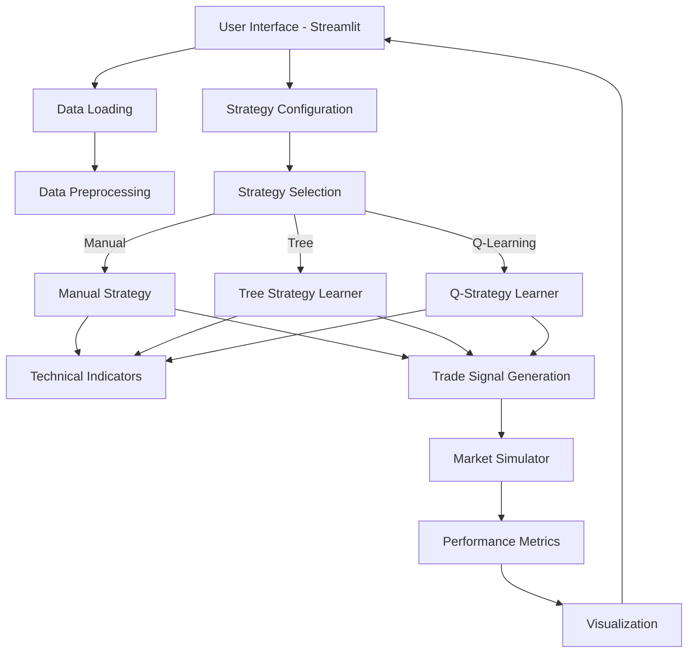

# TradingStrategist 📈

```
████████╗██████╗  █████╗ ██████╗ ██╗███╗   ██╗ ██████╗     ███████╗████████╗██████╗  █████╗ ████████╗███████╗ ██████╗ ██╗███████╗████████╗
╚══██╔══╝██╔══██╗██╔══██╗██╔══██╗██║████╗  ██║██╔════╝     ██╔════╝╚══██╔══╝██╔══██╗██╔══██╗╚══██╔══╝██╔════╝██╔════╝ ██║██╔════╝╚══██╔══╝
   ██║   ██████╔╝███████║██║  ██║██║██╔██╗ ██║██║  ███╗    ███████╗   ██║   ██████╔╝███████║   ██║   █████╗  ██║  ███╗██║███████╗   ██║   
   ██║   ██╔══██╗██╔══██║██║  ██║██║██║╚██╗██║██║   ██║    ╚════██║   ██║   ██╔══██╗██╔══██║   ██║   ██╔══╝  ██║   ██║██║╚════██║   ██║   
   ██║   ██║  ██║██║  ██║██████╔╝██║██║ ╚████║╚██████╔╝    ███████║   ██║   ██║  ██║██║  ██║   ██║   ███████╗╚██████╔╝██║███████║   ██║   
   ╚═╝   ╚═╝  ╚═╝╚═╝  ╚═╝╚═════╝ ╚═╝╚═╝  ╚═══╝ ╚═════╝     ╚══════╝   ╚═╝   ╚═╝  ╚═╝╚═╝  ╚═╝   ╚═╝   ╚══════╝ ╚═════╝ ╚═╝╚══════╝   ╚═╝   
```

> A modular machine learning framework for algorithmic trading strategy development and backtesting with portfolio optimization support

## 📋 About The Project

TradingStrategist is an end-to-end machine learning framework designed for developing, testing, and comparing various algorithmic trading strategies. The platform provides a seamless environment for traders and researchers to experiment with different approaches to market prediction and strategy optimization.

### Key Capabilities
- **Multi-strategy comparison** - Test different approaches side-by-side
- **Portfolio management** - Optimize across multiple stocks with custom weighting
- **Realistic backtesting** - Account for trading costs, slippage, and market impact
- **Interactive visualization** - Analyze performance with intuitive charts and metrics
- **Modular architecture** - Extend with your own indicators and strategies

## 🚀 Getting Started

### Prerequisites
- Python 3.8+ 
- Conda package manager
- Git (for cloning the repository)

### Installation

```bash
# Clone the repository
git clone https://github.com/yourusername/ML-Trading-Strategist.git
cd ML-Trading-Strategist

# Create and activate conda environment
conda env create -f environment.yaml
conda activate trading-env
```

### Running the Application

Simply execute the Streamlit application directly:

```bash
# Run the Streamlit application
streamlit run app.py
```

The application will open in your default web browser at http://localhost:8501

## 🧠 Trading Strategies

TradingStrategist implements three distinct algorithmic trading approaches:

### 1. Manual Strategy
A rules-based approach using technical indicators with configurable parameters:
- **Window Sizes** - Control the lookback period for indicators
- **Thresholds** - Set buy/sell signal levels
- **Indicators** - RSI, Bollinger Bands, MACD, Stochastic, CCI

### 2. Tree Strategy Learner
A machine learning approach using Random Forest ensemble techniques:
- **Prediction Days** - Future period to predict returns
- **Leaf Size** - Controls tree complexity
- **Bags** - Number of trees in the ensemble
- **Position Size** - Trading size in shares

### 3. Q-Strategy Learner
A reinforcement learning approach using Q-Learning:
- **Indicator Bins** - Discretization granularity for state space
- **Learning Parameters** - Learning rate, discount factor, exploration rate
- **Dyna-Q** - Model-based planning iterations
- **Indicator Selection** - Choose which indicators to include in the state

### Portfolio Management
The latest version supports portfolio-based trading with:
- **Multiple Stock Selection** - Trade across a collection of stocks
- **Custom Weighting** - Allocate capital by percentage across different assets
- **Correlation Analysis** - Visual tools for understanding inter-asset relationships

## 📊 System Architecture



## 🔄 Execution Flow

### Basic Execution Flow
1. **User selects parameters** in the Streamlit interface
2. **Historical data is loaded** for the selected stocks and time periods
3. **Strategy training occurs** (for ML-based strategies) using the training period data
4. **Trading signals are generated** for the test period
5. **Market simulator computes** portfolio values accounting for trading costs
6. **Performance metrics are calculated** and displayed
7. **Results are visualized** for strategy comparison

### Detailed Execution Flow with Components
```
┌─────────────────┐     ┌─────────────────┐     ┌─────────────────┐
│  User Interface │     │  Configuration  │     │   Data Sources  │
│   (Streamlit)   │────▶│    Manager      │────▶│   (CSV files)   │
└─────────────────┘     └─────────────────┘     └─────────────────┘
         │                                               │
         │                                               ▼
         │                                      ┌─────────────────┐
         │                                      │  Data Loader &  │
         │                                      │  Preprocessor   │
         │                                      └─────────────────┘
         │                                               │
         ▼                                               ▼
┌─────────────────┐     ┌─────────────────┐     ┌─────────────────┐
│    Strategy     │     │   Technical     │     │    Portfolio    │
│    Selection    │────▶│   Indicators    │────▶│   Constructor   │
└─────────────────┘     └─────────────────┘     └─────────────────┘
         │                                               │
         ▼                                               │
┌─────────────────┐     ┌─────────────────┐     ┌─────────────────┐
│   Manual Rules  │     │  Tree Strategy  │     │  Q-Learning     │
│     Strategy    │     │     Learner     │     │    Strategy     │
└─────────────────┘     └─────────────────┘     └─────────────────┘
         │                      │                       │
         └──────────────────────┼───────────────────────┘
                                │
                                ▼
                      ┌─────────────────┐     ┌─────────────────┐
                      │ Trading Signal  │     │     Market      │
                      │  Generation     │────▶│    Simulator    │
                      └─────────────────┘     └─────────────────┘
                                                       │
                                                       ▼
                      ┌─────────────────┐     ┌─────────────────┐
                      │  Visualization  │◀────│   Performance   │
                      │     Engine      │     │     Metrics     │
                      └─────────────────┘     └─────────────────┘
```

## 🔧 Configuration Parameters

### Strategy Configuration

#### Manual Strategy Parameters
| Parameter | Description | Typical Range |
|-----------|-------------|---------------|
| Window Size | Lookback period for indicators | 5-50 days |
| RSI Window | Period for Relative Strength Index | 5-30 days |
| Buy Threshold | Signal threshold for buy decisions | 0.01-0.10 |
| Sell Threshold | Signal threshold for sell decisions | -0.10-(-0.01) |
| Position Size | Number of shares per trade | 100-10000 shares |

#### Tree Strategy Parameters
| Parameter | Description | Typical Range |
|-----------|-------------|---------------|
| Window Size | Lookback period for features | 5-50 days |
| Buy Threshold | Return threshold for buy label | 0.01-0.10 |
| Sell Threshold | Return threshold for sell label | -0.10-(-0.01) |
| Prediction Days | Days ahead to predict for labels | 1-20 days |
| Leaf Size | Minimum samples per leaf | 1-20 samples |
| Bags | Number of trees in ensemble | 5-50 trees |
| Position Size | Number of shares per trade | 100-10000 shares |

#### Q-Strategy Parameters
| Parameter | Description | Typical Range |
|-----------|-------------|---------------|
| Indicator Bins | Number of discrete states per indicator | 5-20 bins |
| Window Size | Lookback period for indicators | 5-50 days |
| Position Size | Number of shares per trade | 100-10000 shares |
| Learning Rate | Step size for Q-value updates | 0.05-0.50 |
| Discount Factor | Weight for future rewards | 0.50-1.00 |
| Random Action Rate | Initial exploration probability | 0.10-1.00 |
| Random Action Decay | Decay rate for exploration | 0.90-0.99 |
| Dyna-Q Iterations | Model-based planning steps | 0-50 iterations |

### Simulation Parameters
| Parameter | Description | Typical Range |
|-----------|-------------|---------------|
| Starting Portfolio Value | Initial capital | $1,000-$1,000,000 |
| Commission | Fixed cost per trade | $0.00-$50.00 |
| Market Impact | Price impact as percentage | 0.000-0.050 |

## 📁 Project Structure

```
├── app.py                 # Streamlit application
├── environment.yaml       # Conda environment specification
├── README.md              # Project documentation
│
├── configs/               # YAML configuration files
│   ├── data.yaml          # Data source configuration
│   ├── indicators.yaml    # Technical indicators parameters
│   ├── manual_strategy_config.yaml # Manual strategy settings
│   ├── market_sim.yaml    # Market simulator parameters
│   ├── qstrategy.yaml     # Q-Learning strategy settings
│   └── tree_strategy.yaml # Decision tree strategy settings
│
├── data/                  # Stock price data CSV files
│   ├── $DJI.csv           # Dow Jones Industrial Average
│   ├── $SPX.csv           # S&P 500 Index
│   ├── $VIX.csv           # Volatility Index
│   └── *.csv              # Individual stock data (AAPL, MSFT, etc.)
│
└── src/                   # TradingStrategist implementation
    └── TradingStrategist/
        ├── data/          # Data loading and preprocessing
        ├── indicators/    # Technical indicator implementations
        ├── models/        # Strategy implementations
        │   ├── ManualStrategy.py
        │   ├── TreeStrategyLearner.py
        │   └── QStrategyLearner.py
        ├── simulation/    # Market simulator
        └── utils/         # Helper utilities
```

## 🔬 Advanced Usage

### Programmatic Usage
For advanced users or researchers who want to extend the framework:

```python
# Example: Using the TreeStrategyLearner programmatically
from src.TradingStrategist.models.TreeStrategyLearner import TreeStrategyLearner
import datetime as dt

# Create and train a model
learner = TreeStrategyLearner(leaf_size=5, bags=20)
learner.addEvidence(
    symbol="AAPL",
    sd=dt.datetime(2008, 1, 1),
    ed=dt.datetime(2009, 12, 31),
    sv=100000
)

# Generate trading signals
trades = learner.testPolicy(
    symbol="AAPL",
    sd=dt.datetime(2010, 1, 1),
    ed=dt.datetime(2010, 12, 31)
)

# Simulate market with the generated trades
from src.TradingStrategist.simulation.market_sim import compute_portvals
portfolio_values = compute_portvals(orders=trades, start_val=100000, commission=9.95, impact=0.005)

# Calculate performance metrics
from src.TradingStrategist.simulation.market_sim import compute_portfolio_stats
sharpe_ratio, cum_ret, avg_daily_ret, std_daily_ret = compute_portfolio_stats(portfolio_values)
```

### Portfolio Trading Example

```python
# Example: Creating a portfolio strategy
import pandas as pd
import datetime as dt
from src.TradingStrategist.models.TreeStrategyLearner import TreeStrategyLearner
from src.TradingStrategist.simulation.market_sim import compute_portvals

# Portfolio composition
symbols = ["AAPL", "MSFT", "GOOG", "AMZN"]
weights = {"AAPL": 0.3, "MSFT": 0.3, "GOOG": 0.2, "AMZN": 0.2}

# Trading dates
train_start = dt.datetime(2008, 1, 1)
train_end = dt.datetime(2009, 12, 31)
test_start = dt.datetime(2010, 1, 1)
test_end = dt.datetime(2010, 12, 31)

# Starting capital
starting_value = 100000

# Create a combined trades DataFrame
from src.TradingStrategist.data.loader import get_data
prices = get_data(symbols, pd.date_range(test_start, test_end))
all_trades = pd.DataFrame(0, index=prices.index, columns=symbols)

# Apply strategy to each symbol
for symbol in symbols:
    # Allocate capital based on weight
    symbol_value = starting_value * weights[symbol]
    
    # Create and train strategy
    learner = TreeStrategyLearner(leaf_size=5, bags=20)
    learner.addEvidence(symbol=symbol, sd=train_start, ed=train_end, sv=symbol_value)
    
    # Generate trades
    trades = learner.testPolicy(symbol=symbol, sd=test_start, ed=test_end)
    
    # Add to combined trades
    all_trades[symbol] = trades[symbol]

# Compute overall portfolio performance
portfolio_values = compute_portvals(
    orders=all_trades,
    start_val=starting_value,
    commission=9.95,
    impact=0.005
)

print(f"Final Portfolio Value: ${portfolio_values.iloc[-1].values[0]:,.2f}")
```

## 📈 Performance Metrics

The platform evaluates trading strategies using these key metrics:

| Metric | Description |
|--------|-------------|
| **Cumulative Return** | Total percentage return over the entire period |
| **Average Daily Return** | Mean of daily percentage returns |
| **Std Dev Daily Return** | Standard deviation of daily returns (volatility) |
| **Sharpe Ratio** | Risk-adjusted return (higher is better) |
| **Number of Trades** | Total trades executed by the strategy |
| **Trades per Month** | Average trading frequency |

## 🔄 Extending the Framework

### Adding a New Strategy
1. Create a new strategy class in `src/TradingStrategist/models/`
2. Implement the required methods:
   - `__init__()` for initialization and parameters
   - `addEvidence()` for training (if applicable)
   - `testPolicy()` for generating trades
3. Add the strategy to the Streamlit interface in `app.py`

### Adding New Technical Indicators
1. Add your indicator implementation to `src/TradingStrategist/indicators/technical.py`
2. Make sure your indicator handles NaN values and edge cases
3. Update the relevant strategy classes to use your new indicator

## 📄 License

This project is licensed under the MIT License - see the LICENSE file for details.

## 🙏 Acknowledgements

- **Libraries**: NumPy, Pandas, scikit-learn, Streamlit, Matplotlib
- **Data Sources**: Historical stock data providers
- **Contributors**: All individual contributors to this project