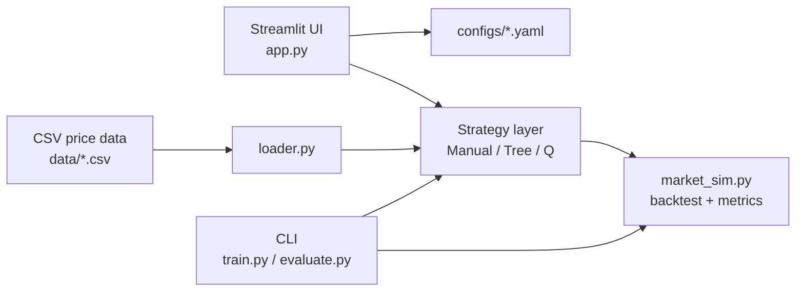
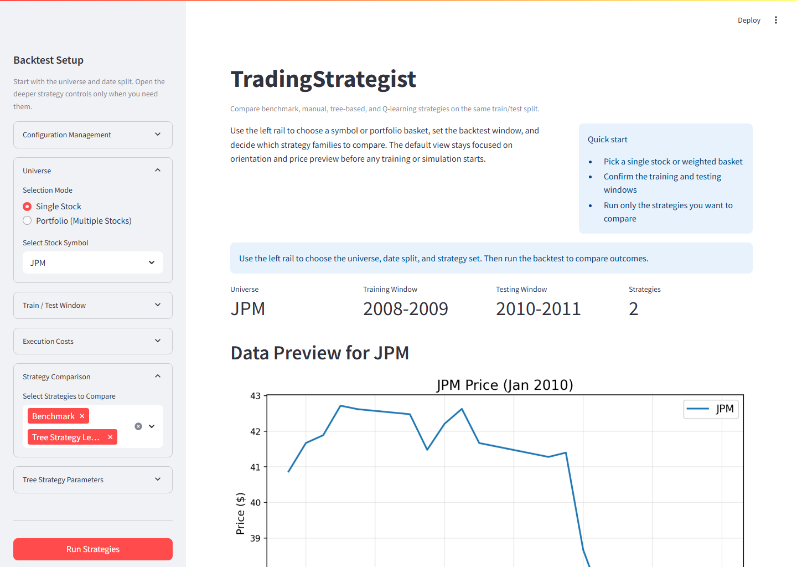

# TradingStrategist

app.py is a Streamlit backtesting dashboard for comparing trading strategies on historical CSV price data.

src/TradingStrategist/__init__.py exposes the package API for a benchmark, a manual rule-based strategy, a bagged-tree learner, and a Q-learning learner.

<!-- README_SURFACE_START -->

```mermaid
flowchart LR
    A["Streamlit UI<br/>app.py"] --> B["configs/*.yaml"]
    A --> D["Strategy layer<br/>Manual / Tree / Q"]
    C["CSV price data<br/>data/*.csv"] --> E["loader.py"]
    E --> D
    D --> F["market_sim.py<br/>backtest + metrics"]
    G["CLI<br/>train.py / evaluate.py"] --> D
    G --> F
```

[](https://adredes-weslee.github.io/ai/finance/machine-learning/reinforcement-learning/2025/05/12/ml-trading-strategist-comparing-learning-approaches.html) [](https://adredes-weslee-ml-trading-strategist-app-pu7qym.streamlit.app/)

  

## Interface Preview



## Quickstart

```bash
pip install -r requirements.txt
streamlit run app.py
# ensure data/SPY.csv and data/JPM.csv are present before running
```

See [Setup and Run](#setup-and-run) for the full environment and verification path.

<!-- README_SURFACE_END -->

## Why This Repository Exists

- The repo answers: does a strategy beat buy-and-hold after commissions and market impact using historical train/test splits and portfolio statistics.
- It supports single-symbol analysis and a manually weighted multi-symbol basket for research and backtesting, not live execution.

## Architecture at a Glance

- UI/config layer: app.py loads YAML defaults from `configs/*.yaml`, lets the user choose single-stock or weighted portfolio mode, and renders comparisons, metrics, and data previews.
- Strategy layer: ManualStrategy.py, TreeStrategyLearner.py, and QStrategyLearner.py, backed by BagLearner.py, RTLearner.py, and QLearner.py; technical.py implements the indicator library.
- Data/simulation layer: loader.py reads `Adj Close` CSVs and adds SPY by default; market_sim.py computes portfolio values and stats; download_sp500_data.py and check_data.py handle refresh and validation.
- CLI/package layer: train.py and evaluate.py are config-driven entry points; `output/` is where generated models, metrics, and plots land.

## Repository Layout

- `.vscode/`
- `configs/`
- `data/`
- `src/`
- `.gitignore`
- `app.py`
- `environment.yaml`
- `README.md`
- `requirements.txt`

## Setup and Run

1. Install the pinned environment from environment.yaml or requirements.txt; the repo targets Python 3.11 with Streamlit, pandas, NumPy, scikit-learn, SciPy, pyyaml, and yfinance.
2. Ensure `data/` contains CSVs with `Date` and `Adj Close`; check_data.py explicitly requires `SPY.csv` and `JPM.csv`.
3. Launch the dashboard with `streamlit run app.py`; use download_sp500_data.py only if you need to refresh the tracked CSV set.
4. The CLI entrypoints use different import conventions between `app.py` and the training/evaluation scripts.

## Core Workflows

- Use the sidebar in app.py to load or save YAML defaults, pick symbols, dates, costs, and strategies, then run benchmark/manual/tree/Q comparisons.
- Inspect the built-in preview before running: single-stock mode shows a Jan-2010 price chart/table; multi-stock mode shows normalized series and a correlation matrix.
- Train models with `train.py --config <path-to-yaml>`; it pickles learners under `output/models/` with symbol/date-based filenames.
- Evaluate strategies with `evaluate.py --config <path-to-yaml>`; it writes metrics CSVs and performance PNGs into `output/`.
- Refresh market data with download_sp500_data.py; it pulls tickers from Wikipedia and price history from Yahoo Finance with retry/backoff handling.

## Known Limitations

- The codebase is a local research and backtesting stack, not a production trading platform or portfolio-optimization service.
- Multi-asset mode is per-symbol execution with equal or custom weights, not a cross-asset optimizer.
- `market_sim.py` supports several cost models and slippage, but the UI/CLI mostly expose only commission and impact.
- There is no `tests/` directory, no packaging manifest such as `pyproject.toml` or `setup.py`, and no `LICENSE` file.
- Config naming is inconsistent across UI, CLI, and YAML (`training` vs `in_sample`, `tree_strategy_learner` vs `strategy_learner`, `q_strategy_learner` vs `q_strategy`).
- src/TradingStrategist/__init__.py eagerly imports the strategy modules, so package import depends on a working Python environment before any script runs.
